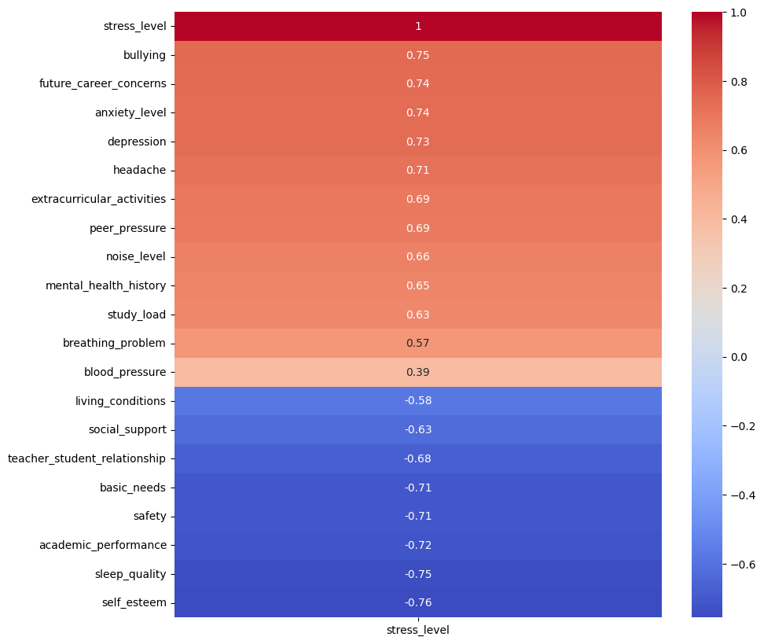
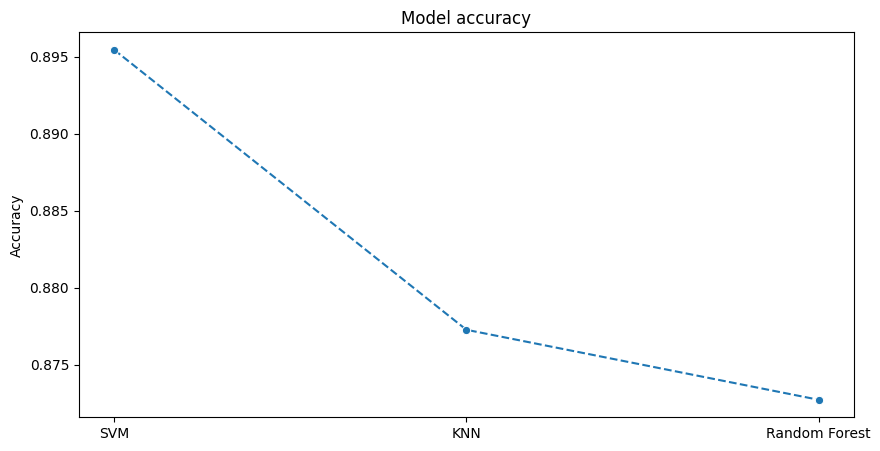
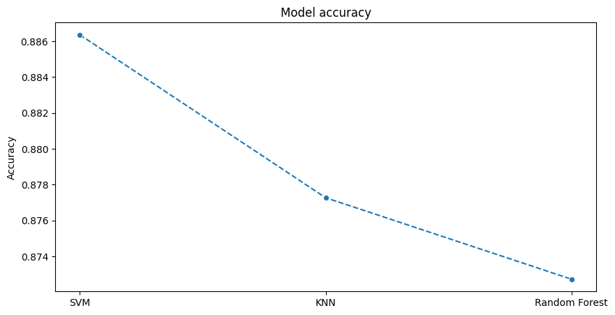

# Analisis dan Prediksi

## Project Overview

- **Project Name**: Analisis dan Prediksi Stress pada Mahasiswa
- **Description**: Project ini bertujuan untuk menganalisis dan memprediksi tingkat stress pada mahasiswa berdasarkan data yang diperoleh dari kaggle dengan menggunakan beberapa algoritma machine learning.

## Data Overview

- **Data Source**: [Kaggle](https://www.kaggle.com/alfinaditya/stress-mahasiswa)
- **Data Description**: Data ini berisi tentang tingkat stress mahasiswa berdasarkan beberapa faktor.
- **Data Size**: 1100 rows x 21 columns

Faktor-faktor yang mempengaruhi tingkat stress mahasiswa, berdasarkan data yang diperoleh dari kaggle, dapat dilihat pada grafik berikut:

dari grafik tersebut, dapat dilihat bahwa 5 faktor yang paling mempengaruhi tingkat stress mahasiswa adalah faktor bullying, jenjang karir, kecemasan, depresi, sakit kepala.

Pada percobaan kali ini, akan dilakukan prediksi tingkat stress mahasiswa berdasarkan faktor-faktor tersebut dengan menggunakan beberapa algoritma machine learning

1. SVM
2. KNN
3. Random Forest

berikut adalah hasil akurasi dari ketiga algoritma tersebut tanpa melakukan hyperparameter tuning:

dari hasil tersebut, dapat dilihat bahwa algoritma SVM memiliki akurasi yang paling tinggi yaitu sebesar 89,5%

Akurasi setelah dilakukan hyperparameter tuning:

dari hasil tersebut, dapat dilihat bahwa algoritma SVM memiliki akurasi yang paling tinggi yaitu sebesar 88,5%

## Conclusion

Hasil dari percobaan ini menunjukkan bahwa algoritma SVM memiliki akurasi yang paling tinggi dalam memprediksi tingkat stress mahasiswa berdasarkan faktor-faktor yang mempengaruhinya.
